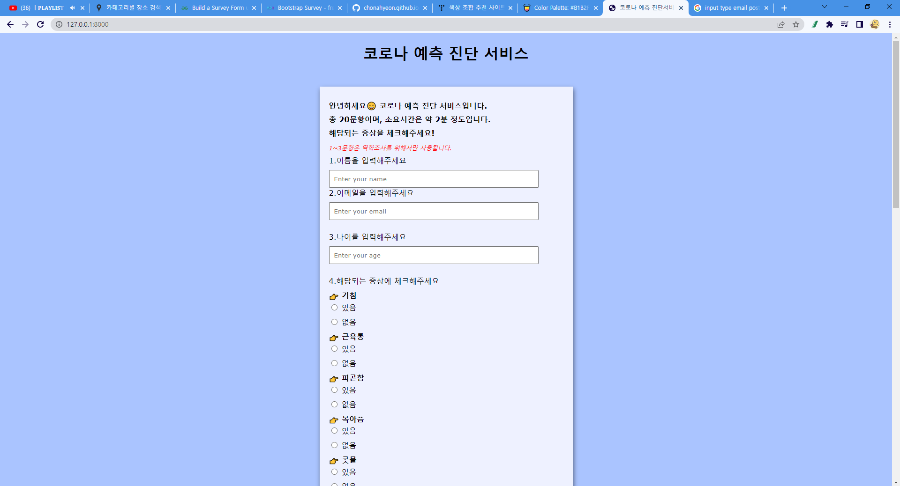

# Capstone-Design-Covid

### 프로젝트 개요
코로나가 지속됨에 따라 의료서비스를 이용하기 힘든 사람들은 코로나 바이러스 감염 유무를 확인하는 것이 어렵다.                               
우리는 높은 검사비와 의료비로 인해 병원 기피 현상이 있는 국가와 의료수준이 낮은 국가, 간편한 검사를 원하는 사람들을 대상으로 머신러닝 알고리즘을 이용한 Covid-19와 유사 질병 간의 비교 예측 모델을 개발하고 웹으로 배포한다.                                   
Make disease prediction system based on comparative prediction model between Covid-19 and pandemic influenza.                        
                                           
### 코로나 예측 판단 시스템
heroku를 통해 배포 완료. 2022-10-26               
<https://covid-capstone-project.herokuapp.com/>                

### 개발환경
* 개발도구: Visual Studio Code
* 개발언어: Python,JS
* 프레임워크: Django
* 소스코드관리: Git
* 배포: Heroku(ClearDB)

### 시스템 구성도 
* Flow-Chart                                 

### 주요 기능
1. 사용자가 입력한 증상을 기반으로 병명 예측 (코로나,독감,감기,알레르기)
2. 사용자 위치를 기준으로 가까운 약국,병원,편의점을 볼 수 있음 (카카오맵 API사용)
3. 코로나 증상 데이터 시각화 카테고리

### 사용방법  
1. 웹사이트 접속하기
2. 설문조사 Form에 맞춰 증상 입력하기
3. 예측결과 확인
                                       
                                       

